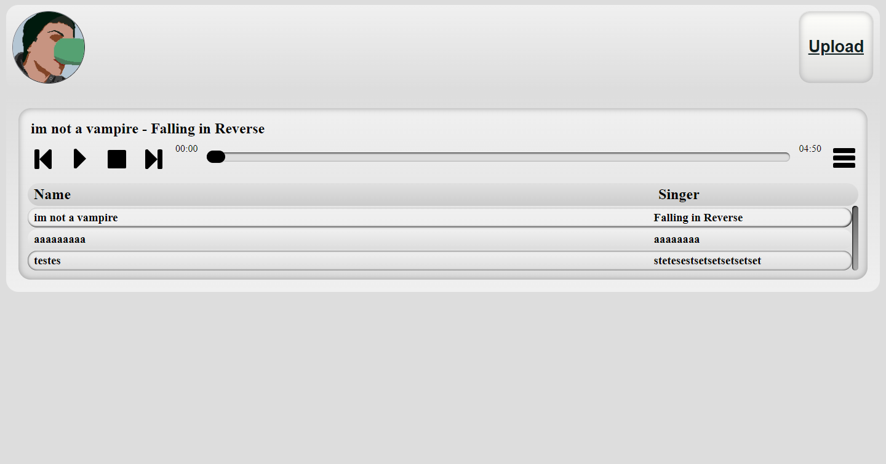
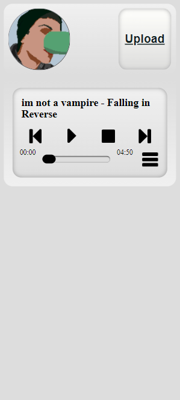

# RiverSong

Web music player made with next.js

Use with https://github.com/BRonen/RiverSongApi to serve musics

## Layout

A Header component with a link to Upload page and my profile picture linked with my github profile.
The player has the name of the music and the singer/band name above the controls of music and menu.
The menu is a table with name and singer name that plays the music if you click.

Will be improved using some cloud storage soon
